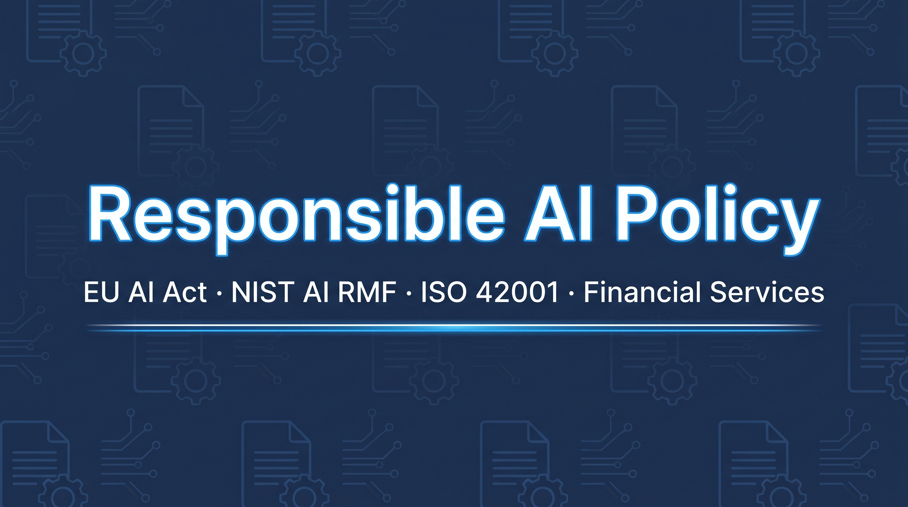
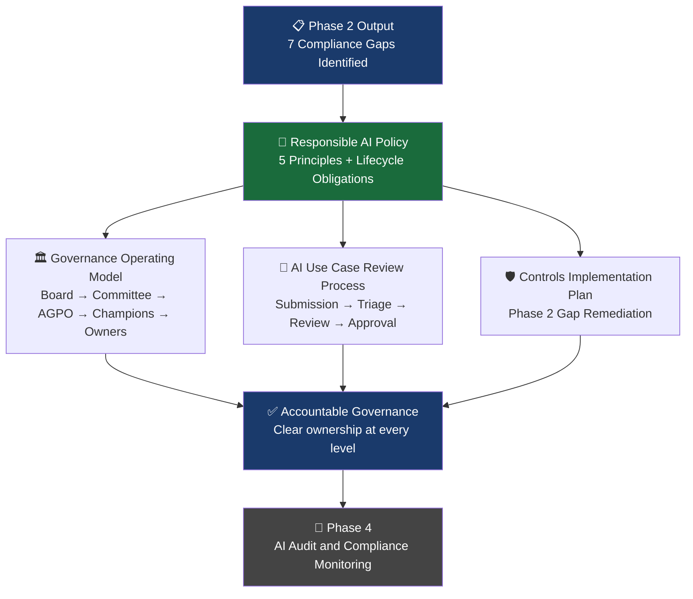
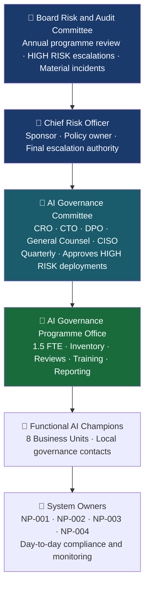
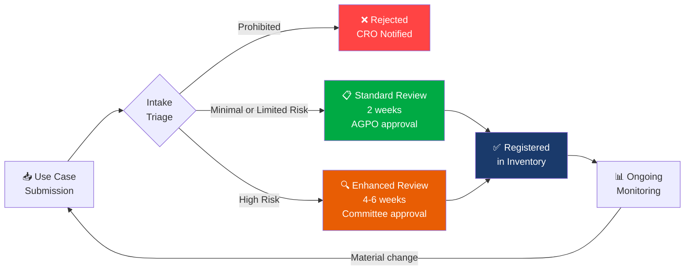

<div align="center">

<!-- BANNER: Generate using Google Flow with this prompt and save as banner.png in docs/ folder
GOOGLE FLOW PROMPT:
"A clean, professional banner for a GitHub repository. Wide format (1280x640px).
Title text: 'Responsible AI Policy'. Subtitle: 'EU AI Act · NIST AI RMF · ISO 42001 · Financial Services'.
Medium navy blue background (#1a2744). Subtle document or policy pattern in background.
Icons representing governance, policy documents and compliance on both sides.
Modern, corporate, minimal. No people. Color accents: bright electric blue and white.
High contrast - text must be clearly readable."
-->


# 📋 Responsible AI Policy and Governance Framework

# NorthPoint Financial Services

[](https://artificialintelligenceact.eu/)
[](https://airmf.nist.gov/)
[](https://www.iso.org/standard/81230.html)
[](https://oecd.ai/en/ai-principles)
[](LICENSE)
[]()

**Phase 3 of an end-to-end AI Governance Programme**

</div>

---

## 📌 Project Overview

[Phase 1](https://github.com/franciscovfonseca/AI-System-Inventory) and [Phase 2](https://github.com/franciscovfonseca/AI-Risk-Assessment) of the NorthPoint Financial Services' AI Governance Programme established *what* AI systems the organisation operates and *what risks* they carry. Phase 2 identified seven compliance gaps across NP-001 and NP-002 - including unresolved bias risk in the Credit Scoring Engine and the absence of a formal governance policy covering how AI is approved, monitored and retired.

Phase 3 closes that gap. This project establishes the full governance infrastructure that NorthPoint was missing: a Responsible AI Policy grounded in regulatory requirements, a Governance Operating Model with clear accountability at every level and an AI Use Case Review Process that determines how new AI systems enter the portfolio. It also delivers a Controls Implementation Plan that directly addresses the specific gaps identified in the Phase 2 risk assessment.

> **The progression:** Phase 1 answered "what are we running?" Phase 2 answered "what could go wrong?" Phase 3 answers "how do we govern it?" - translating risk findings into policy, structure and enforceable process.

---

## 🎯 What I Delivered

| Deliverable | Description |
|---|---|
| **Responsible AI Policy** | NorthPoint's formal policy defining five AI principles and the lifecycle obligations that enforce them |
| **Governance Operating Model** | Five-tier accountability structure from board level to system owner, with defined roles and decision authority |
| **AI Use Case Review Process** | Risk-proportionate submission and approval workflow for all new AI deployments |
| **Controls Implementation Plan** | Targeted controls addressing the seven compliance gaps identified in Phase 2 for NP-001 and NP-002 |

---

## 🗺 Governance Framework Overview



---

## 📝 Responsible AI Policy

NorthPoint's Responsible AI Policy establishes five binding principles that apply to every AI system in the portfolio - from initial design through to decommission.

| Principle | Commitment | Enforcement Mechanism |
|---|---|---|
| **Fairness** | No AI system may produce discriminatory outcomes across protected characteristics | Mandatory bias assessment before deployment; quarterly monitoring post-deployment |
| **Transparency** | Customers informed when AI plays a material role in decisions affecting them | Disclosure requirements built into use case approval checklist |
| **Accountability** | Every AI system has a named owner responsible for its governance | System Owner field mandatory in AI inventory; owner notified of all incidents |
| **Safety and Robustness** | Systems undergo adversarial testing; performance monitored continuously | Robustness testing schedule required for all HIGH RISK systems |
| **Human Oversight** | Meaningful human review required for all consequential automated decisions | Human oversight documentation required at registration; "rubber-stamp" approvals explicitly prohibited |

The policy applies to all AI systems regardless of whether they are internally built or procured from third-party vendors. Vendor contracts must include equivalent governance obligations.

→ Full policy document: [`docs/responsible-ai-policy.md`](docs/responsible-ai-policy.md)

---

## 🏛 Governance Operating Model

NorthPoint's governance structure operates across five tiers, ensuring accountability from board level through to individual system owners.



| Role | Decision Authority |
|---|---|
| Board Risk and Audit Committee | Approves programme strategy; oversees material incidents |
| Chief Risk Officer | Policy owner; final escalation on contested decisions |
| AI Governance Committee | Approves HIGH RISK system deployments; reviews quarterly |
| AI Governance Programme Office | Approves MINIMAL and LIMITED RISK systems; maintains inventory |
| System Owners | Immediate suspension authority in incident scenarios |

→ Full operating model: [`docs/governance-operating-model.md`](docs/governance-operating-model.md)

---

## 🔄 AI Use Case Review Process

All new AI systems must pass through a structured review and approval process before deployment. The process is risk-proportionate - lower-risk systems move in two weeks while HIGH RISK systems receive rigorous multi-week scrutiny.



| Review Type | Applies To | Timeline | Approval Authority | Key Requirements |
|---|---|---|---|---|
| Standard Review | Minimal and Limited Risk | 2 weeks | AI Governance Programme Office | Classification confirmation, data lawfulness, disclosure mechanism |
| Enhanced Review | High Risk | 4-6 weeks | AI Governance Committee | Full risk assessment, bias evaluation, technical documentation, monitoring plan |

→ Full review process: [`docs/ai-review-process.md`](docs/ai-review-process.md)

---

## 🛡 Controls Implementation Plan

Phase 2 identified seven compliance gaps across NP-001 and NP-002. This plan translates each gap into a specific control with owner, timeline and success criterion.

| Gap | System | Control | Owner | Target | Status |
|---|---|---|---|---|---|
| Bias testing not commissioned | NP-001 | Independent disparate impact audit across all protected characteristics | Head of Credit Risk | Q2 2025 | 🟡 In Progress |
| Explainability layer not implemented | NP-001 | SHAP post-hoc explainability + customer refusal letter templates | Head of Credit Risk | Q2 2025 | 🟡 In Progress |
| Review schedule not formalised | NP-001 | Added to AI Governance Committee calendar - 6-monthly cycle | CRO | Q2 2025 | ✅ Complete |
| Monitoring to risk register feedback loop missing | NP-001 | Monthly monitoring dashboard linked to risk register review trigger | Head of Credit Risk | Q3 2025 | 🔴 Not Started |
| Robustness testing schedule not formalised | NP-002 | Documented testing schedule with pass/fail criteria | Head of Financial Crime | Q2 2025 | 🟡 In Progress |
| False positive SLA not defined | NP-002 | SLA established: < 0.5% false positive rate with monthly board reporting | Head of Financial Crime | Q2 2025 | ✅ Complete |
| Fairness metrics not defined for NP-001 | NP-001 | Demographic parity ratio and equalised odds thresholds defined | Head of Credit Risk | Q2 2025 | 🟡 In Progress |

→ Full controls implementation plan: [`docs/controls-implementation-plan.md`](docs/controls-implementation-plan.md)

---

## 🔗 Programme Context

| Phase | Project | Status |
|---|---|---|
| Phase 1 | [AI System Inventory and Classification Engine](https://github.com/franciscovfonseca/AI-System-Inventory) | ✅ Complete |
| Phase 2 | [AI Risk Assessment](https://github.com/franciscovfonseca/AI-Risk-Assessment) | ✅ Complete |
| Phase 3 | Responsible AI Policy and Governance Framework *(this project)* | ✅ Complete |
| Phase 4 | AI Audit and Compliance Monitoring | 🔄 Coming Soon |

---

## 📁 Repository Structure

```
AI-Governance-Policy/
├── README.md                            ← You are here
├── docs/
│   ├── banner.png                       ← Project banner
│   ├── responsible-ai-policy.md         ← Formal policy - five principles and lifecycle obligations
│   ├── governance-operating-model.md    ← Five-tier accountability structure and decision authority
│   ├── ai-review-process.md             ← Use case submission and approval workflow
│   └── controls-implementation-plan.md  ← Phase 2 gap remediation with owners and timelines
└── LICENSE
```

---

## 🧠 Skills Demonstrated

| Skill Area | What This Project Shows |
|---|---|
| **AI Governance Design** | End-to-end governance programme design from policy through to operational controls |
| **EU AI Act Compliance** | Deployer obligation mapping; lifecycle governance requirements; risk-proportionate review design |
| **NIST AI RMF - Govern** | Organisational accountability structures; policy design; culture and oversight mechanisms |
| **ISO 42001** | AI Management System requirements applied to a regulated financial services context |
| **OECD AI Principles** | Human-centered values operationalised into enforceable policy commitments |
| **AI GRC** | End-to-end governance, risk and compliance programme design for regulated AI environments |
| **Responsible AI** | Fairness, transparency, accountability and human oversight principles translated into operational process |
| **Organisational Design** | Committee structure, role definition and decision authority matrix for AI governance functions |
| **Executive Communication** | Policy documents and governance frameworks written for board and senior leadership audiences |

---

## 📚 Frameworks and References

| Framework | Resource |
|---|---|
| EU AI Act (Official Text) | [EUR-Lex 2024/1689](https://eur-lex.europa.eu/legal-content/EN/TXT/?uri=CELEX:32024R1689) |
| NIST AI Risk Management Framework 1.0 | [airmf.nist.gov](https://airmf.nist.gov/) |
| ISO/IEC 42001:2023 - AI Management Systems | [iso.org/standard/81230](https://www.iso.org/standard/81230.html) |
| OECD AI Principles | [oecd.ai/en/ai-principles](https://oecd.ai/en/ai-principles) |
| ISO 31000:2018 - Risk Management | [iso.org/standard/65694](https://www.iso.org/standard/65694.html) |

---

<div align="center">

**franciscovfonseca** · [GitHub](https://github.com/franciscovfonseca) · [LinkedIn](https://linkedin.com/in/franciscovfonseca)

[](LICENSE)

*Part of an ongoing AI Governance Portfolio · [View all projects →](https://github.com/franciscovfonseca)*

</div>
